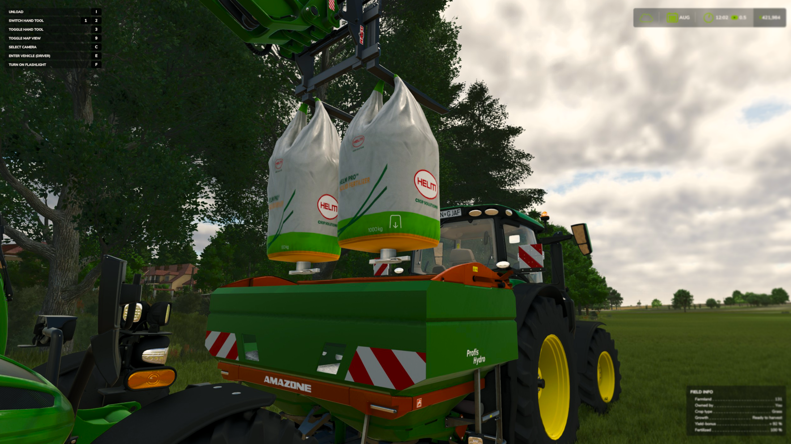
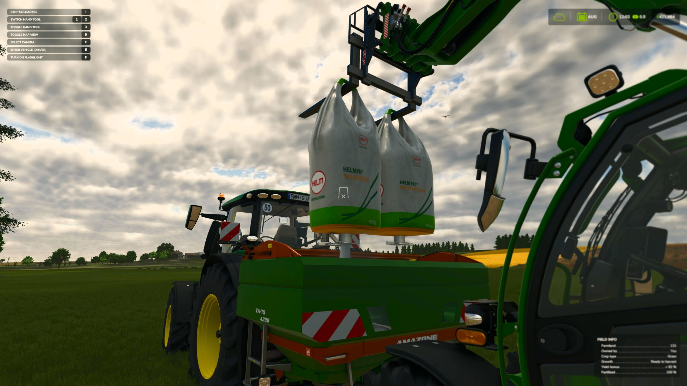
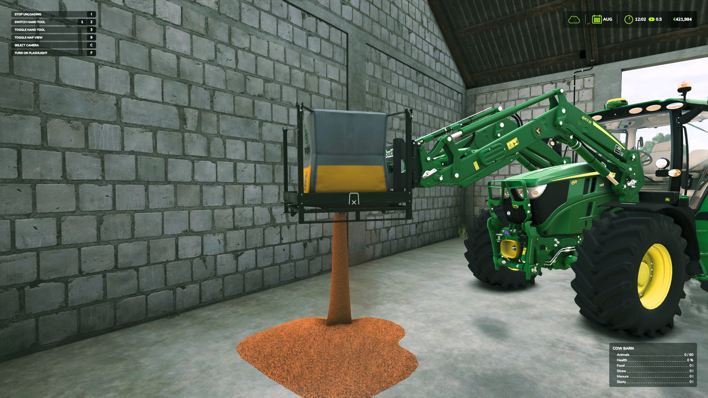
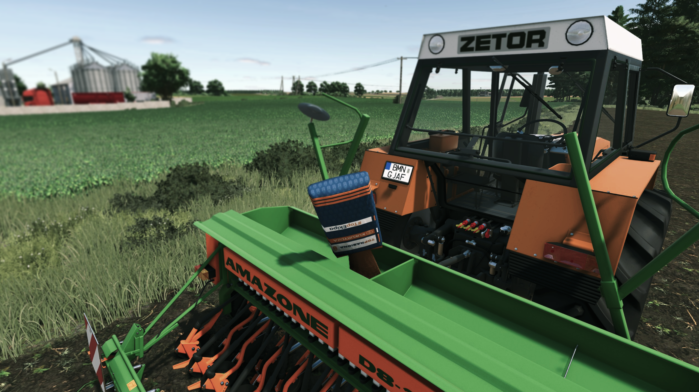

   
  <b>Manual Big Bag</b> adds a touch of realism by making you manually open the discharge spout of Big Bags &mdash;
   
  instead of bags emptying automatically over containers, you must hop out, walk up, and start the unloading yourself.
   
   

## Installation

1. Download the latest version of the mod from the [Releases](https://github.com/modnext/manualBigBag/releases/) page.
2. Copy the downloaded `.zip` file to your Farming Simulator mods folder:
   - Windows: `Documents\My Games\FarmingSimulator2025\mods\`
   - macOS: `~/Library/Application Support/FarmingSimulator2025/mods/`
   - Linux: `~/FarmingSimulator2025/mods/`
3. Start Farming Simulator 2025 and enable the mod in the Mods menu.

## Keybindings

| Key                 | Action                                            |
| ------------------- | ------------------------------------------------- |
| `I`                 | Unload / Stop Unloading                           |

## Screenshots

## License

Distributed under the GPL-3.0 license. See [LICENSE](https://github.com/modnext/manualBigBag/blob/main/LICENSE) for more information.
